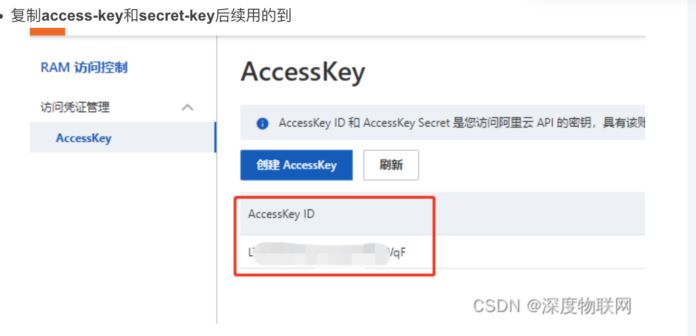

# 说明
Cert-manager是用户证书管理的组件。

测试k8s版本为1.27.3，使用阿里云DNS，对istio gateway进行范域名证书的申请。
安装完成后，可以使用istio-system/gateway来对所有的service的https请求自动添加Let's Encrypt证书。


# 安装


1. 安装cert-manager

按照 https://cert-manager.io/docs/installation/kubectl/ 安装v1.12.0版本。
执行下面命令安装：

```shell
kubectl apply -f https://github.com/cert-manager/cert-manager/releases/download/v1.12.0/cert-manager.yaml
```

2. 目前使用阿里云DNS，安装阿里addon

参考代码库https://github.com/yangsuiyun/alidns-webhook 和 https://blog.csdn.net/changzengli/article/details/124171660

```shell
k apply -f https://raw.githubusercontent.com/yangsuiyun/alidns-webhook/master/deploy/bundle.yaml 
```

3. 更新账号信息

* 修改ali-account.yaml，将其中access-key和secret-key替换成自己的。从阿里云控制台获取，
* 修改certificate.yaml，将其中secretName替换为刚才创建的secret的名称。dnsNames换成实际域名。
* 修改clusterissuer.yaml，将邮箱替换成自己的邮箱。
* 修改gateway.yaml，将其中hosts替换成实际域名。

4. 安装账号、证书等，将该目录下的yaml apply下

安装过程中，通过k get certificate 获取证书状态，一般需要2分钟。状态变成Ready后，会生成对应secret。